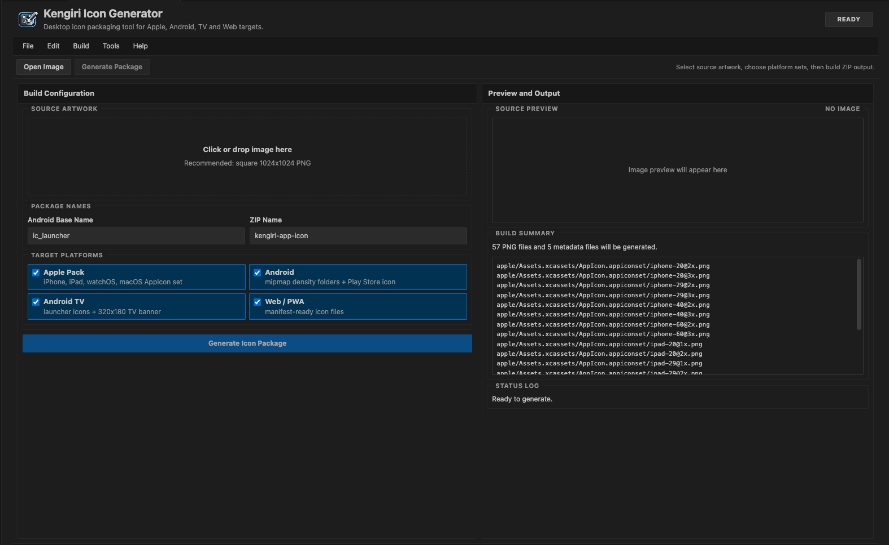
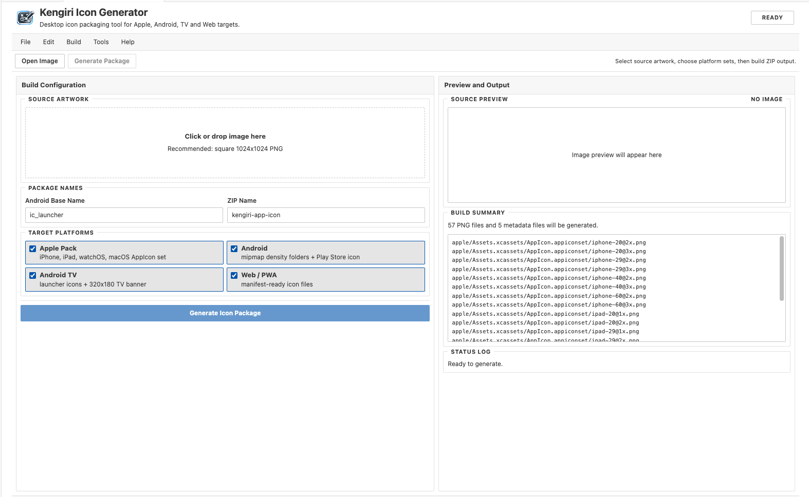
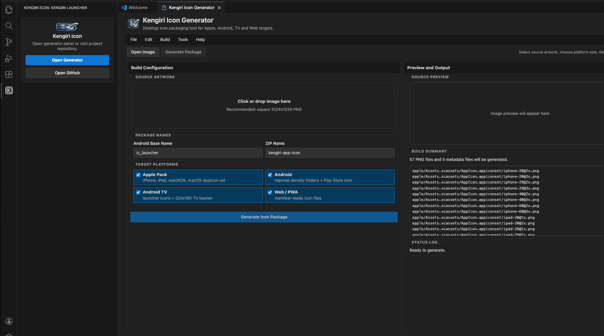

# Kengiri Icon Generator for VS Code

Kengiri Icon Generator is a Visual Studio Code extension that creates production-ready app icon packages from a single source image.

It is designed for mobile and cross-platform teams that need consistent icon exports for Apple, Android, Android TV, and Web/PWA projects without leaving the editor.

## Why Kengiri Icon Generator

- Generate full multi-platform icon sets from one image.
- Keep icon packaging inside the VS Code workflow.
- Export ZIP output with folder structure and metadata files.
- Reduce manual resizing errors and repetitive design tasks.

## Preview

### Generator Overview



### Generator Overview (Light Theme)



### Activity Bar Launcher



## Supported Platforms

- Apple pack
  - iPhone
  - iPad
  - watchOS
  - macOS
  - `Assets.xcassets/AppIcon.appiconset` with `Contents.json`
- Android
  - `mipmap-*` launcher sizes
  - round launcher icons
  - Play Store icon
- Android TV
  - launcher icon sizes
  - `320x180` TV banner
- Web/PWA
  - `manifest.webmanifest`
  - web icon sizes

## Core Features

- Drag-and-drop source image upload.
- Real-time build summary and output plan.
- Configurable Android base icon name.
- Configurable ZIP package name with sane fallback.
- Activity Bar launcher integration.
- Theme-aware UI aligned with VS Code light/dark appearance.

## Command

- `Kengiri: Open Icon Generator`

You can run the command from the Command Palette (`Ctrl/Cmd + Shift + P`).

## Activity Bar Integration

The extension adds a dedicated **Kengiri Icon** container in the Activity Bar.

- Click the Kengiri logo to open the generator panel.
- Use the launcher view to open the generator or repository.

## Output Structure

A generated ZIP package contains platform-specific folders and metadata files, including:

- `apple/Assets.xcassets/AppIcon.appiconset/...`
- `android/mipmap-*/...`
- `android-tv/...`
- `web/icons/...`
- `web/manifest.webmanifest`
- `README.txt`

## Privacy and Processing

All icon generation runs locally inside VS Code.

- No external upload is required by the extension.
- Your source image and generated files remain on your machine.

## Installation and Local Development

```bash
npm install
npm run build
```

Run in Extension Development Host:

1. Open this repository in VS Code.
2. Press `F5`.
3. Run `Kengiri: Open Icon Generator`.

## Build Outputs

- `dist/extension.js`
- `dist/webview.js`
- `dist/webview.css`

## Marketplace Packaging

Create a VSIX package:

```bash
npm run package:vsix
```

Publish to VS Code Marketplace:

```bash
npm run publish:marketplace
```

Before publish, ensure:

1. `publisher` in `package.json` matches your Marketplace publisher ID.
2. You are authenticated in `vsce`.
3. Version is incremented.

## Repository

- Homepage: <https://github.com/oguzhan18/kengiri-icon>
- Issues: <https://github.com/oguzhan18/kengiri-icon/issues>

## License

MIT
